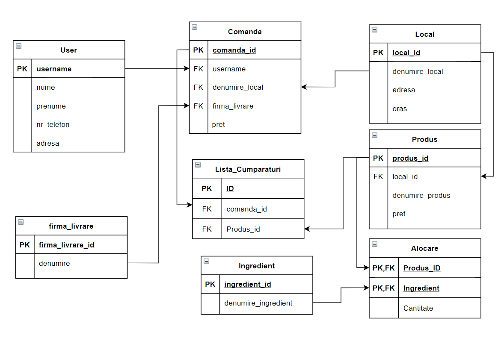

# Platforma Food Delivery
## Elemente Avansate de Programare - CTI - 2020/21

---

### ETAPA 1

* In cadrul sistemului creat, se pot efecuta urmatoarele operatii:
    * Adaugare curier in cadrul companiei de livrari
    * Listare curieri care sunt angajati la un anumit livrator
    * Listare produse specifice unui local
    * Listare ingrediente dintr-un produs
    * Plasare comanda
    * Adaugare review asupra comenzii
    * Adaugare User care va folosi platforma
    * Listare comenzi plasate de catre un anumit user
    * Cautare un anumit produs in mai multe localuri
    * Cautare local in functie de oras
    

* Obiectele definite:
    * Curier
    * Firma_livrare
    * Masina
    * Ingredient
    * Local
    * Produs
    * Comanda
    * Review
    * User
    * Persoana
  
---
### ETAPA 2

* Noile clase definite pentru aceasta etapa:
    * services.CSVTools
    * services.Singleton
  
---
### ETAPA 3

#### Diagrama conceptuala pentru serverul de baze de date:

Pentru crearea bazei de date, am folosit MySQL.